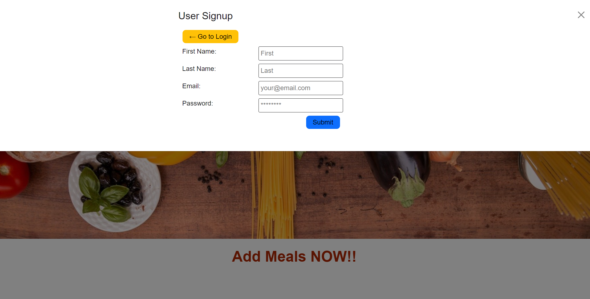
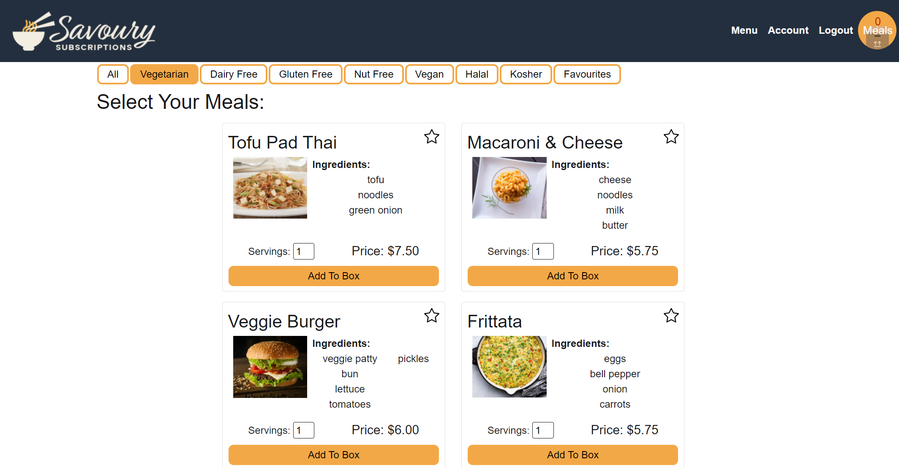
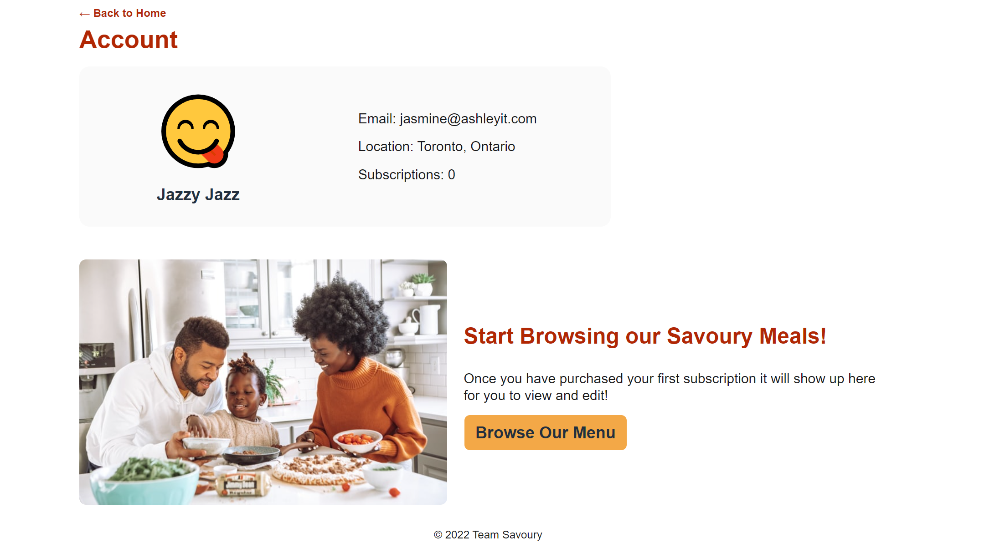

# Savory-Subscriptions

## Table of Contents

1. [Description](#description)
2. [Screenshots](#screenshots)
3. [Technologies Used](#technologies-used)
4. [Installation](#installation)
5. [Contributors](#contributors)
6. [Deployed Link](#deployed-link)

## Description

Savoury Subscriptions is a food subscription service where a user can signup/login, pick their favourite meals, and filter them by diet preference. The user can also save their diet preferences on their account page. Once they have their meals chosen, they can checkout using Stripe payment.

## Screenshots

Landing Page:


Signup:


Meals Page:


Account Page:


## Technologies Used

These are just some of the technologies used throughout the process of this application:

- React
- Node.js
- Express
- Apollo
- GraphQL
- Mongoose
- Stripe

## Installation

Clone the repo:
``` 
git clone https://github.com/ScalexanderB/Savory-Subscriptions.git
```
Install npm packages/dependencies in root folder:
```
npm install
```
Run on your local machine in root folder using 'concurrently':
```
npm run develop
```

## Contributors

- Scott Bradley - [ScalexanderB](https://github.com/ScalexanderB)
- Samantha Urwin - [samurwin](https://github.com/samurwin) 
- Dave Quinn - [Qcent](https://github.com/samurwin)
- Jasmine Ashley - [jasmin3ashl3y](https://github.com/jasmin3ashl3y)

## Deployed Link

Heroku link here